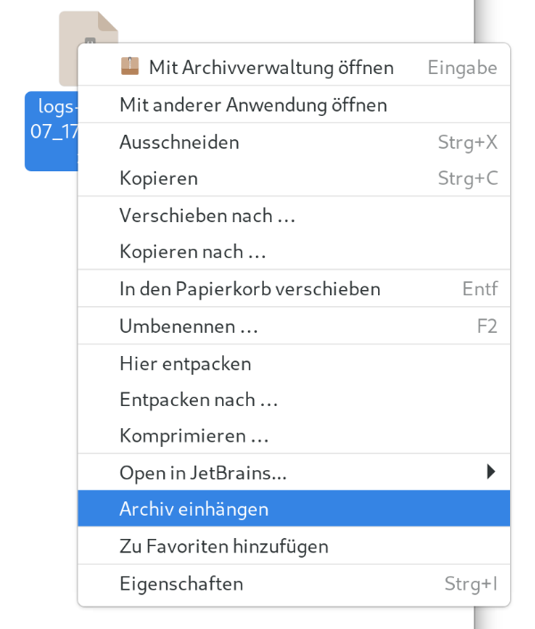
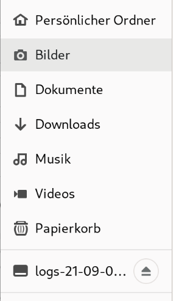

# archive-mount-nautilus

Adds context actions to mount archives using `gvfsd-archive`




## Automatic installation

### AUR

Available in [Arch Linux AUR (archive-mount-nautilus-git)](https://aur.archlinux.org/packages/archive-mount-nautilus-git)

### Install script for Debian-based (apt), Arch-based (pacman) and RPM-based (dnf) distros

Simply execute this line of command. The script might ask you to enter your sudo password, if it needs to install a missing dependency:

```bash
wget -qO- https://raw.githubusercontent.com/Lucas-Steinmann/archive-mount-nautilus/main/install.sh | bash
```

If you don't want to run a random script asking for sudo, kudos to you. You can also follow the manual installation procedure below.

## Manual installation

- Ensure the packages providing `python-nautilus` and `gvfsd-archive` is installed.
    - `nautilus-python` and `gvfs-archive`for yum-based distros
    - `gvfs` and `python-nautilus` for arch-based distros
    - `gvfs-backends` and `python3-nautilus` for debian-based distros
- Copy `archive-mount.py` from this repo to `~/.local/share/nautilus-python/extensions`.

## Uninstallation

```
rm ~/.local/share/nautilus-python/extensions/archive-mount.py
```

You can also uninstall the dependencies, if they are not used by other software.
